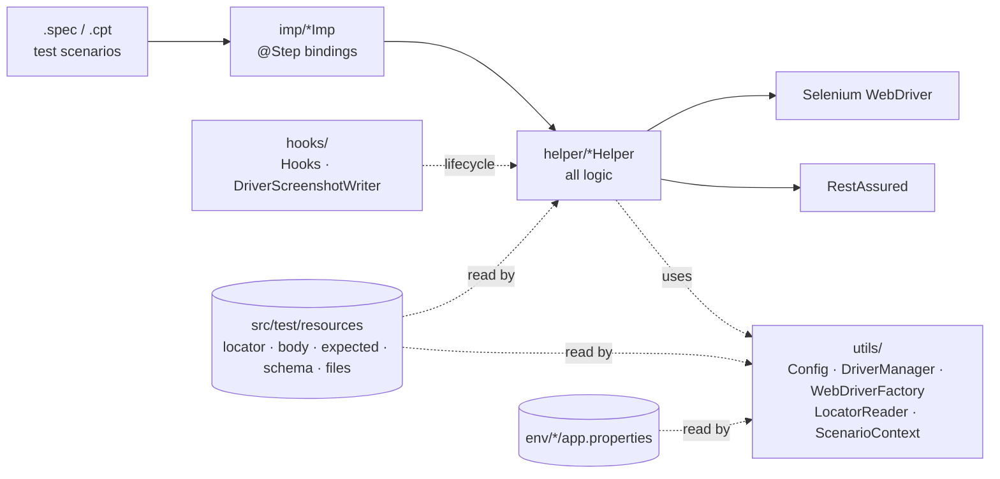
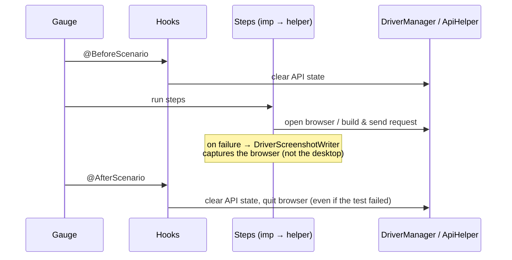

# QA Final Layihə — Leyla Kazimli

QA Engineering kursunun bitirmə layihəsi. Müəllimin verdiyi Gauge arxitekturası əsasında yazılıb, framework koduna (`src/test/java`) dəyişiklik edilməyib.

| Hissə | Test obyekti | Spec-lər |
|---|---|---|
| API | `https://api.anarabbas.com`: bitirmə layihəsi backlog-u, 10 task, 3 epic | `specs/final-api/` |
| UI | `https://www.azal.az` | `specs/final-ui/` *(hazırlanır)* |

## Necə işə salmaq

Tələblər: Java 11+, Maven, Gauge (`gauge install java`, `gauge install html-report`).

```bash
mvn test -Dgauge.specs.dir=specs/final-api                    # bütün API testləri (153 ssenari)
mvn test -Dgauge.specs.dir=specs/final-api -Dtags=GRAD-302    # bir task-ın testləri
```

> Windows PowerShell-də `-D...` parametrlərini dırnağa alın: `mvn test "-Dgauge.specs.dir=specs/final-api"`

Hesabat: `reports/html-report/index.html`

## API testləri: 153 ssenari, 14 spec

| Epic | Task | Spec | Ssenari |
|---|---|---|---|
| Saxlanmış alıcılar | GRAD-101 POST /beneficiaries | `GRAD-101_beneficiaries`, `GRAD-101_beneficiary_limit` | 16 |
| | GRAD-102 GET /beneficiaries | `GRAD-102_beneficiary_list` | 14 |
| | GRAD-103 DELETE /beneficiaries/{id} | `GRAD-103_beneficiary_delete` | 7 |
| Kartlar | GRAD-201 POST /cards | `GRAD-201_cards`, `GRAD-201_card_limit` | 17 |
| | GRAD-202 GET /cards/{id} | `GRAD-202_card_details` | 6 |
| | GRAD-203 POST /cards/{id}/block | `GRAD-203_card_block` | 18 |
| | GRAD-204 POST /cards/{id}/unblock | `GRAD-204_card_unblock` | 9 |
| Ödənişlər | GRAD-301 GET /billers | `GRAD-301_billers` | 8 |
| | GRAD-302 POST /bill-payments | `GRAD-302_payments`, `_idempotency`, `_limits` | 38 |
| | GRAD-303 GET /bill-payments | `GRAD-303_payment_history` | 20 |

Hər ssenarinin adı Excel-dəki test case ID-si ilə başlayır (məs. `TC-PAY-026`), tag-larında task nömrəsi var. Bu, Excel → spec traceability-ni təmin edir.

### Stabillik (flaky testlərin qarşısının alınması)

- **Sandbox qaydası:** hər login yeni, boş mühit açır. Hər spec öz login faylı ilə **bir dəfə** login olur (keşli login step-i, `@BeforeClass`-ın Gauge qarşılığı). Spec-in ssenariləri eyni datanı görür, spec-lər isə bir-birinə qarışmır.
- **Limitlər:** kart açan ssenarilər sonda kartı bloklayır (3 kart limiti), limit testləri (10 alıcı, 3 kart) ayrıca təmiz sandbox-da işləyir.
- **Test datası ssenarinin özündə yaradılır.** Əvvəlki run-dan və ya əl ilə yaradılmış dataya asılılıq yoxdur. GRAD-303-də D2 dataseti (21 ödəniş) spec-in birinci "Hazırlıq" ssenarisində yaradılır.
- **Idempotency açarları** hər run-da təsadüfi yaradılır (`${random.uuid}`).
- **Sabit gözləmə (sleep) istifadə edilmir.**
- **Pul dəyərləri mətn kimi müqayisə olunur** (`"0.21"`), çünki `0.2` kimi onluq kəsrlər float tipində dəqiq saxlanmır və ədədi müqayisə yalançı xəta verir.

### Yoxlamalar yalnız status code deyil

Xəta cavablarında `code` (mətn yox), `details` massivində hansı sahənin səhv olduğu və neçə xəta qayıtdığı; uğurlu cavablarda sahələrin dəyəri, formatı (regex) və tipi; uğursuz əməliyyatdan sonra isə datanın **dəyişmədiyi** (status, balans) ayrıca GET sorğusu ilə yoxlanılır.

---

*Aşağıda müəllimin framework sənədləri olduğu kimi saxlanılıb.*

---

# Gauge Test Automation Framework — Web UI & REST API

A ready-to-use test automation framework for graduation projects.
Pick **any** website or REST API, point the framework at it, and write tests in plain-language `.spec` files
using ~150 prebuilt steps — **no Java code required** for everyday testing.

> 🇦🇿 Azerbaijani version: [README.az.md](README.az.md)

| Technology | Role |
|---|---|
| [Gauge](https://gauge.org) | Test runner — Markdown specs, tags, concepts, HTML report |
| Selenium 4 + WebDriverManager | Web UI automation (Chrome, Firefox, Edge, Safari, headless) |
| RestAssured 5 + JSON Schema Validator | REST API testing |
| Jackson / Gson | JSON handling (body templates, locators, deep comparison) |
| Appium | Android (separate module — `MobileImp`) |
| Maven, Java 11+ | Build & dependency management |

---

## Table of contents

1. [Quick start](#1-quick-start)
2. [Adapting the framework to your project](#2-adapting-the-framework-to-your-project)
3. [Architecture](#3-architecture)
4. [Project structure](#4-project-structure)
5. [Configuration](#5-configuration)
6. [Variables `${...}`](#6-variables-)
7. [Locators](#7-locators)
8. [Web UI steps](#8-web-ui-steps)
9. [API steps](#9-api-steps)
10. [Full examples](#10-full-examples)
11. [Extending the framework](#11-extending-the-framework)
12. [Framework self-tests](#12-framework-self-tests)
13. [Troubleshooting](#13-troubleshooting)

---

## 1. Quick start

### Install (once)

```bash
# macOS
brew install gauge maven
# Windows
choco install gauge maven

gauge install java
gauge install html-report
```

Java 11 or newer and a browser (Chrome by default) are required. Browser drivers are downloaded automatically.

### Run

```bash
mvn test                                                   # all specs in specs/
mvn test -Dgauge.specs.dir=specs/api-testing               # one folder
mvn test -Dgauge.specs.dir=specs/ui-testing/login.spec     # one file
mvn test -Dtags="smoke"                                    # by tag
mvn test -Dtags="api & !slow"                              # tag expression
mvn test -Denv=ci                                          # env/default + env/ci (headless)
mvn test -Pparallel                                        # specs in parallel processes
headless=true browser=firefox mvn test                     # one-off config override
```

> ⚠️ **Always run through Maven (`mvn test`).** Running `gauge run` directly does not see the Maven
> dependencies and fails with `package io.restassured does not exist`.

### Report

Open `reports/html-report/index.html` after a run. It contains:

- every step with pass/fail status and error message;
- each API request line (`POST https://… → 201 (184 ms)`) and response body;
- a **browser screenshot** for every failed UI step.

---

## 2. Adapting the framework to your project

| Step | What to do | Where |
|---|---|---|
| 1 | Set your site / API addresses | `env/default/app.properties` → `ui_base_url`, `api_base_url` |
| 2 | Describe page elements (one JSON file per page) | `src/test/resources/locator/loginPage.json` |
| 3 | Add request bodies (templates with `${variables}`) | `src/test/resources/body/` |
| 4 | Define login once as a concept | `specs/login.cpt` |
| 5 | Write your scenarios | `specs/**/*.spec` |
| 6 | Run `mvn test`, open the report | `reports/html-report/index.html` |

Every step is demonstrated in working form in [`framework-tests/`](framework-tests/). Read those specs as a cookbook.

---

## 3. Architecture

### Layers



| Layer | Responsibility | Rule |
|---|---|---|
| **`specs/`** | *What* to test, in plain language | No code, only steps |
| **`imp/`** | Maps each step sentence (`@Step`) to a method | One-line methods; no logic |
| **`helper/`** | *How* to do it — waits, retries, assertions, error messages | All reusable logic lives here |
| **`utils/`** | Infrastructure — config, driver lifecycle, locators, variables | No Gauge steps |
| **`hooks/`** | Runs automatically before/after each scenario | Cleanup, screenshots |

### Scenario lifecycle



### Design principles

- **Isolation** — each scenario starts clean: request, response, headers and scenario variables never leak
  into the next scenario. The browser always closes, even after a failure.
- **Thread safety** — `WebDriver` and API state are kept in `ThreadLocal`, so parallel execution is safe.
- **Flake resistance** — every UI assertion retries until `explicit_wait_seconds`; API calls retry
  automatically on `429 Too Many Requests` / `503` (honouring `Retry-After`), with a hard timeout.
- **Readable failures** — `"Login Title" text mismatch. Expected: "Welcome", actual: "Error"`; API
  failures include status and body.
- **Single source of truth** — one config file, one locator repository, one place to resolve `${variables}`.
- **Backward compatible** — older step sentences keep working, alongside new aliases.

### Key classes

| Class | Purpose |
|---|---|
| `utils.Config` | Reads `env/*.properties` (exposed by Gauge as environment variables); URL resolution |
| `utils.DriverManager` | Holds the current `WebDriver` per thread; `requireDriver()` gives a clear error when no browser is open |
| `utils.WebDriverFactory` | Creates Chrome/Firefox/Edge/Safari, headless or not; drivers via WebDriverManager |
| `utils.LocatorReader` | Loads **all** `locator/*.json` once; converts to `By`; supports inline locators; rejects duplicates |
| `utils.ScenarioContext` | Scenario / spec / suite variables and `${...}` substitution (incl. random data) |
| `helper.BaseHelper` | Common UI base: `visible()`, `clickable()`, `present()`, `assertEventually()` |
| `helper.ApiHelper` | Per-scenario request builder & sender: timeout, UTF-8, retry, report logging |
| `helper.ApiAssertHelper` | JSON/body/header/schema assertions, deep comparison with matchers |
| `helper.AuthHelper` | Login with a suite-wide token cache (one login request for the whole run) |
| `hooks.Hooks` | `@BeforeScenario` / `@AfterScenario` cleanup |
| `hooks.DriverScreenshotWriter` | Browser screenshot on failure (auto-discovered by Gauge) |

---

## 4. Project structure

```
env/
  default/app.properties        ← project configuration (URLs, browser, timeouts, retries)
  ci/app.properties             ← CI overrides (headless) — used with -Denv=ci
specs/                          ← YOUR tests (.spec) and concepts (.cpt)
framework-tests/                ← framework self-tests + local UI playground (read as examples)
src/test/java/
  imp/                          ← @Step classes (Browser, Click, Type, Scroll, Verify, Api*, Auth, Header, Data, Mobile)
  helper/                       ← logic (BaseHelper, ClickHelper, TypeHelper, ScrollHelper, VerifyHelper,
                                   BrowserHelper, ApiHelper, ApiAssertHelper, AuthHelper)
  utils/                        ← Config, DriverManager, WebDriverFactory, LocatorReader, ScenarioContext, AppiumDriverFactory
  hooks/                        ← Hooks, DriverScreenshotWriter
src/test/resources/
  locator/                      ← UI locators (*.json, all loaded automatically)
  body/                         ← API request bodies (support ${variables})
  expected/                     ← expected response JSON (support matchers)
  schema/                       ← JSON Schema files
  files/                        ← files for UI upload / API multipart
reports/html-report/            ← generated HTML report
```

---

## 5. Configuration

File: `env/default/app.properties`

| Key | Default | Description |
|---|---|---|
| `ui_base_url` | — | Relative URLs (`"/login"`) are appended to this |
| `browser` | `chrome` | `chrome`, `firefox`, `edge`, `safari`; add `-headless` (e.g. `chrome-headless`) |
| `headless` | `false` | Run the browser without a window |
| `explicit_wait_seconds` | `10` | Default wait/retry time for UI steps |
| `keep_browser_open` | `false` | Keep the browser open after a scenario (debugging) |
| `api_base_url` | — | Relative endpoints (`"/users"`) are appended to this |
| `api_timeout_seconds` | `30` | Fail a request if the server does not answer in time |
| `api_max_retries` | `2` | Retries on `429` / `503` |
| `api_retry_max_wait_seconds` | `10` | Upper bound for a single retry wait |
| `api_log_all` | `true` | Log full request/response to the console |
| `api_relaxed_https` | `false` | Accept self-signed certificates |

**Environments:** `env/<name>/app.properties` overrides `env/default` when run with `mvn test -Denv=<name>`.

**One-off override:** set an environment variable, e.g. `headless=true mvn test`.

**Inside a spec:** `${env.api_base_url}`.

---

## 6. Variables `${...}`

Variables work in **any step parameter, body file, expected-JSON file, table cell and locator name**.

| Expression | Value |
|---|---|
| `${userId}`, `${token}` | A value saved earlier in the run |
| `${random.email}` | `test_1a2b3c4d@test.com` — new on every use |
| `${random.uuid}` · `${random.number}` · `${random.name}` · `${random.phone}` | Random data |
| `${timestamp}` · `${today}` | `1790622519782` · `2026-09-29` |
| `${env.key}` | Any key from `app.properties` |
| `${projectDir}` | Absolute path of the project |

**Lookup order:** scenario → spec → suite → built-ins → configuration.
Scenario variables are cleared after each scenario. Use the *global* / *for all tests* steps to keep a value
for the whole run.

---

## 7. Locators

All `*.json` files in `src/test/resources/locator/` are loaded once. Use one file per page.

```json
{
  "Login Email Input": { "locatorType": "ID",         "locatorValue": "email" },
  "Login Button":      { "locatorType": "CSS",        "locatorValue": "button[type='submit']" },
  "Error Message":     { "locatorType": "XPATH",      "locatorValue": "//div[contains(@class,'error')]" },
  "Product Cards":     { "locatorType": "CLASS_NAME", "locatorValue": "product-card" }
}
```

Supported types: `ID`, `NAME`, `CSS` / `CSS_SELECTOR`, `XPATH`, `CLASS_NAME`, `TAG_NAME`, `LINK_TEXT`, `PARTIAL_LINK_TEXT`.

**Inline locators** (no JSON entry needed): `"id=email"`, `"css=#login"`, `"name=q"`, `"xpath=//button[text()='Sign in']"`.

The same element name in two files is an error, so a wrong locator is never used silently.

---

## 8. Web UI steps

Step sentences are written in Azerbaijani. Copy them exactly and replace only the quoted parameters.

### Browser & navigation
| Step | Meaning |
|---|---|
| `* Brauzeri aç ve keçid et "/login"` | Open the configured browser and go to a URL |
| `* "chrome" brauzeri aç ve keçid et "https://site.com"` | Open a specific browser |
| `* "/products" adresine keçid et` | Navigate in the open browser |
| `* Sehifeni yenile` | Refresh |
| `* Evvelki sehifeye qayıt` / `* Növbeti sehifeye keç` | Back / forward |
| `* Pencere ölçüsünü "375" x "812" et` | Resize the window (responsive tests) |
| `* Brauzeri bağla` | Close the browser (optional — the hook closes it anyway) |

### Clicks & mouse
| Step | Meaning |
|---|---|
| `* "Login Button" elementine klik et` | Click (scrolls if covered) |
| `* "Sign in" metnli elemente klik et` | Click by visible text, no locator needed |
| `* "Menu Items" siyahısında "Profile" metnli elemente klik et` | Click the item with this text in a list |
| `* "Product Cards" siyahısında "2" nömreli elemente klik et` | Click the Nth item (1-based) |
| `* "Row" elementine iki defe klik et` | Double click |
| `* "Row" elementine sağ klik et` | Right click |
| `* "Menu" elementinin üzerine gel` | Hover |
| `* "Card" elementini "Basket" elementinin üzerine sürükle` | Drag & drop |
| `* "Hidden Button" elementine JavaScript ile klik et` | JS click (last resort) |
| `* "Cookie Accept" elementi "3" saniye içinde görünerse klik et` | Click only if it appears (banners, popups) |

### Forms & keyboard
| Step | Meaning |
|---|---|
| `* "Email Input" elementine "user@test.com" yaz` | Clear and type |
| `* "Search" elementine "iphone" yaz ve Enter düymesine bas` | Type + Enter (also `Tab`, `Shift` variants) |
| `* "Email Input" elementini temizle` | Clear |
| `* "Search" elementinde "ARROW_DOWN" düymesine bas` | Press a key on an element (`ENTER`, `TAB`, `ESCAPE`, `ARROW_DOWN`, …) |
| `* Sehifede "ESCAPE" düymesine bas` | Press a key on the focused element |
| `* "Country" dropdown-undan "Azerbaijan" metnini seç` | Select by visible text |
| `* "Country" dropdown-undan "az" deyerini seç` | Select by value |
| `* "Country" dropdown-undan "2" indeksli seçimi seç` | Select by index (0-based) |
| `* "Terms" checkbox-unu işaretle` / `* "Terms" checkbox-unun işaretini kaldır` | Check / uncheck (idempotent) |
| `* "Avatar Input" elementine "photo.png" faylını yükle` | Upload a file from `resources/files/` |

### Waits
| Step | Meaning |
|---|---|
| `* "Dashboard" görsensin deye maksimum "10" saniye gözle` | Wait until visible |
| `* "Loader" yox olana qeder maksimum "15" saniye gözle` | Wait until gone |
| `* "Submit" kliklene bilene qeder gözle` | Wait until clickable |
| `* Sehifenin tam yüklenmesini gözle` | Wait for `document.readyState == complete` |
| `* "2" saniye gözle` | Hard wait — avoid; prefer the waits above |

### Assertions (all retry until the default wait)
| Step | Meaning |
|---|---|
| `* "Title" elementinin metni "Welcome" olmalıdır` | Exact text |
| `* "Title" elementin içinde "Wel" yazısı var` | Text contains |
| `* Sehifede "Order confirmed" yazısı olmalıdır` | Visible page text contains |
| `* "Modal" görünür olmalıdır` / `* "Modal" görünmemelidir` | Visible / not visible |
| `* "Item" sehifede mövcud olmamalıdır` | Not in the DOM |
| `* "Submit" aktiv olmalıdır` / `* "Submit" deaktiv olmalıdır` | Enabled / disabled |
| `* "Terms" seçilmiş olmalıdır` / `* "Terms" seçilmemiş olmalıdır` | Selected / not selected |
| `* "Email Input" input deyeri "a@b.com" olmalıdır` | Input value |
| `* "Link" elementinin "href" atributu "/about" olmalıdır` | Attribute equals |
| `* "Tab" elementinin "class" atributunda "active" olmalıdır` | Attribute contains |
| `* "Product Cards" elementlerinin sayı "12" olmalıdır` | Element count |
| `* "Product Cards" elementlerinin sayı en az "1" olmalıdır` | Minimum count |
| `* Sehife başlığı "Home" olmalıdır` / `* Sehife başlığında "Home" olmalıdır` | Title equals / contains |
| `* URL "/dashboard" içermelidir` / `* URL "/dashboard" olmalıdır` | URL contains / equals |

### Saving values from the page
| Step | Meaning |
|---|---|
| `* "Order Number" elementinin metnini "orderNo" olaraq yadda saxla` | Save text → `${orderNo}` |
| `* "Link" elementinin "href" atributunu "link" olaraq yadda saxla` | Save attribute → `${link}` |

### Scrolling
| Step | Meaning |
|---|---|
| `* "Footer" elementine scroll et` | Scroll element to the centre |
| `* "Footer" elementine scroll et ve klik et` | Scroll and click |
| `* Sehifenin aşağısına scroll et` / `* Sehifenin yuxarısına scroll et` | Bottom / top |
| `* "500" piksel vertical scroll et` / `* "300" piksel horizontal scroll et` | By pixels (negative = up/left) |

### Tabs, iframes, alerts, cookies, storage, JS
| Step | Meaning |
|---|---|
| `* Yeni açılan taba keç` | Switch to the newest tab |
| `* "2" nömreli taba keç` | Switch to tab N (1-based) |
| `* Cari tabı bağla ve esas taba qayıt` | Close tab, return to the first |
| `* Yeni tabda "/help" aç` | Open a URL in a new tab |
| `* "Payment Frame" iframe-ine keç` / `* Iframe-den esas sehifeye qayıt` | Enter / leave an iframe |
| `* Alert-i qebul et` / `* Alert-i legv et` | Accept / dismiss alert or confirm |
| `* Alert metninde "Are you sure" olmalıdır` | Alert text contains |
| `* Alert-e "John" yaz ve qebul et` | Answer a prompt |
| `* Cookie elave et "session" = "abc"` · `* "session" cookie-si mövcud olmalıdır` · `* Bütün cookie-leri sil` | Cookies |
| `* LocalStorage-e yaz "lang" = "en"` · `* LocalStorage ve SessionStorage-i temizle` | Web storage |
| `* JavaScript icra et "window.scrollTo(0, 0)"` | Execute JavaScript |
| `* Ekran görüntüsü çek` | Attach a screenshot to the report |

---

## 9. API steps

### Building a request
| Step | Meaning |
|---|---|
| `* Set base Url to "https://api.site.com"` · `* API base URL "…" olsun` | Override `api_base_url` for this scenario |
| `* Initalize request specification` · `* Yeni API sorğusu hazırla` | Start a fresh request |
| `* Add Endpoint "/users/${userId}"` · `* Endpoint "/users/{id}" olsun` | Endpoint (query strings allowed) |
| `* Path parametri elave et "id" = "5"` | Fills `{id}` |
| `* Query parametri elave et "page" = "2"` | `?page=2` (URL-encoded) |
| `* Header elave et "X-Lang" = "en"` · `* Add as a header "Accept" = "application/json"` | Header |
| `* Headerleri elave et` + table | Several headers (`\|key\|value\|`) |
| `* Form parametri elave et "username" = "john"` | `application/x-www-form-urlencoded` |
| `* Multipart fayl elave et "file" = "photo.png"` | Multipart upload from `resources/files/` |

### Request body
| Step | Meaning |
|---|---|
| `* Body olaraq "new-user.json" faylını elave et` · `* Add body as file resource "new-user.json"` | Body from `resources/body/` (template) |
| `* Body olaraq "{\"name\":\"John\"}" metnini elave et` · `* Add body as text "…"` | Inline JSON |
| `* Body-ni cedvelden qur` + table | Build JSON from a table; `address.city` → nested object; `12` → number, `true` → boolean, `null` → null |

Body template example — `src/test/resources/body/new-user.json`:

```json
{ "email": "${random.email}", "name": "${random.name}", "role": "user" }
```

### Sending
| Step | Meaning |
|---|---|
| `* "POST" sorğusu gönder` | Send with any method: GET, POST, PUT, PATCH, DELETE, HEAD, OPTIONS |
| `* "GET" sorğusu gönder "/users/1"` | Set endpoint and send |
| `* Get request and display respons` · `Post …` · `Put …` · `Patch …` · `* Delete request and display response` | Classic variants |
| `* API e GET request gönder "/users"` | Quick GET without headers or body |
| `* Cavabı çap et` | Pretty-print the response |

### Authentication
| Step | Meaning |
|---|---|
| `* "/auth/login" ünvanına "login.json" ile login ol ve "token" tokenini yadda saxla` | Log in and save `${token}` (`Bearer …`) and `${rawToken}`. **Cached for the whole run** — one login request in total |
| `* "/auth/login" ünvanına "login.json" ile yeni sessiya açaraq login ol ve "data.accessToken" tokenini yadda saxla` | Fresh login, no cache |
| `* Authorization header-ine tokeni elave et` · `* Add as a header "Authorization" = "token"` | Use the saved token |
| `* Bearer token elave et "${rawToken}"` | Explicit bearer token |
| `* Basic auth elave et istifadeci "user" şifre "pass"` | Basic auth |
| `* API key header elave et "x-api-key" = "secret"` | API key |
| `* Token keşini temizle` | Force the next login to hit the server (e.g. after a logout test) |

Recommended login concept — `specs/login.cpt`:

```markdown
# Log in as admin
* "/auth/login" ünvanına "login.json" ile login ol ve "token" tokenini yadda saxla
```

> Logging in with a real request in every scenario quickly hits the API rate limit (`429`). Use the cached step.

### Response assertions

JSON paths use RestAssured **GPath**: `id`, `user.email`, `data[0].name`, `items.size()`,
`data.findAll { it.price > 100 }.size()`, `items.sum { it.qty * it.price }`, `data.find { it.id == 5 }.name`.

| Step | Meaning |
|---|---|
| `* Status kodunun "200" olmalıdır` | Status equals |
| `* Status kodu "200" ile "299" arasında olmalıdır` | Status in range |
| `* Json cavabında "email" deyeri "a@b.com" beraberdir` | Equals (numbers and booleans compare as text: `"5"`, `"true"`) |
| `* Json cavabında "status" deyeri "deleted" olmamalıdır` | Not equal |
| `* Json cavabında "name" deyerinde "John" olmalıdır` | Contains (text or array item) |
| `* Json cavabında "email" deyeri ".+@.+" regex-ine uyğun olmalıdır` | Full regex match |
| `* Json cavabında "price" deyeri ">" "0" olmalıdır` | Numeric compare: `>` `>=` `<` `<=` `==` `!=` |
| `* Json cavabında "id" deyeri boş olmamalıdır` | Not null / blank / empty |
| `* Json cavabında "deletedAt" deyeri null olmalıdır` | Is null |
| `* Json cavabında "id" açarı mövcud olmalıdır` / `* … "password" açarı olmamalıdır` | Key exists / absent (sensitive data leaks) |
| `* Json cavabında verilen "total" deyeri ededdir` | Is a number |
| `* Json cavabında "tags" deyerinin tipi "array" olmalıdır` | Type: `string` `number` `boolean` `array` `object` `null` |
| `* Json cavabında "data" massivinin ölçüsü "10" olmalıdır` | Array size |
| `* Json cavabında "data" massivinin ölçüsü en az "1" olmalıdır` | Minimum array size |
| `* Json cavabında "data.status" siyahısındakı bütün deyerler "active" olmalıdır` | Every item equals (filter tests) |
| `* Json cavabında "data.price" siyahısı artan sırada olmalıdır` / `… azalan sırada …` | Sorted asc / desc (sort tests) |
| `* Json cavabında "data.id" siyahısındakı deyerler unikal olmalıdır` | No duplicates |
| `* Cavab body-sinde "success" olmalıdır` | Raw body contains |
| `* Header "Content-Type" movcud olmalıdır` · `* Header "Content-Type" deyerinde "json" olmalıdır` | Response headers |
| `* Respons cavab müddeti "1500" milliSaniyeden az olmalıdır` | Response time |

### Validating the whole body

**1. Table** — all mismatches are reported together:

```markdown
* Json cavabını cedvel ile yoxla
   |path          |value          |
   |--------------|---------------|
   |id            |${userId}      |
   |email         |@regex:.+@.+   |
   |address.city  |Baku           |
   |createdAt     |@notNull       |
```

**2. Expected JSON file** — `src/test/resources/expected/user.json`. Every field in the file must be present
in the response; extra response fields are ignored; arrays are matched element by element.

```json
{
  "id": "@number",
  "email": "@regex:^[^@]+@[^@]+$",
  "role": "user",
  "tags": ["@string"],
  "address": { "city": "Baku", "zip": "@notEmpty" },
  "createdAt": "@ignore"
}
```

```markdown
* Json cavabı "user.json" faylındakı gözlenilen JSON-a uyğun olmalıdır
```

| Matcher | Passes when |
|---|---|
| `@ignore` | always (field may even be missing) |
| `@notNull` / `@notEmpty` | not null / not null, blank, or empty |
| `@string` `@number` `@boolean` `@array` `@object` | value has that type |
| `@regex:<pattern>` | full regex match |
| `@contains:<text>` | contains the text |
| anything else | exact equality (after `${variable}` substitution) |

**3. JSON Schema** — `src/test/resources/schema/user.schema.json`:

```markdown
* Cavab "user.schema.json" JSON schema-sına uyğun olmalıdır
```

**4. Request → response round-trip** — the server returned what was sent:

```markdown
* Json cavabında "name" deyeri "new-user.json" request body-sindeki "name" ile eyni olmalıdır
```

### Saving & comparing values
| Step | Meaning |
|---|---|
| `* Json cavabında "id" deyerini "userId" olaraq yadda saxla` · `* Save value of "id" as "userId"` | Save → `${userId}` (scenario) |
| `* Json cavabında "id" deyerini "userId" olaraq bütün testler üçün yadda saxla` | Save for the whole run |
| `* Header "Location" deyerini "location" olaraq yadda saxla` | Save a response header |
| `* Json cavabında "id" deyeri "userId" ile eynidir` / `… ile ferqlidir` | Compare with a saved variable |

### Variable steps
| Step | Meaning |
|---|---|
| `* "email" deyişenine "${random.email}" deyerini ver` | Set a scenario variable |
| `* "env" global deyişenine "staging" deyerini ver` | Set a run-wide variable |
| `* "email" deyişeni "a@b.com" olmalıdır` | Assert a variable |
| `* "email" deyişeninin deyerini çap et` | Print a variable |

---

## 10. Full examples

### API — CRUD with a deep body check

```markdown
# Users API

* Log in as admin

## Create, read and delete a user
tags: api, crud

* Yeni API sorğusu hazırla
* Authorization header-ine tokeni elave et
* Body olaraq "new-user.json" faylını elave et
* "POST" sorğusu gönder "/users"
* Status kodunun "201" olmalıdır
* Json cavabı "user.json" faylındakı gözlenilen JSON-a uyğun olmalıdır
* Json cavabında "email" deyeri "new-user.json" request body-sindeki "email" ile eyni olmalıdır
* Json cavabında "password" açarı olmamalıdır
* Json cavabında "id" deyerini "userId" olaraq yadda saxla

* Yeni API sorğusu hazırla
* Authorization header-ine tokeni elave et
* "GET" sorğusu gönder "/users/${userId}"
* Status kodunun "200" olmalıdır
* Cavab "user.schema.json" JSON schema-sına uyğun olmalıdır

* Yeni API sorğusu hazırla
* Authorization header-ine tokeni elave et
* "DELETE" sorğusu gönder "/users/${userId}"
* Status kodu "200" ile "204" arasında olmalıdır
```

### Web UI — login flow

`src/test/resources/locator/loginPage.json`:

```json
{
  "Login Email":    { "locatorType": "ID",  "locatorValue": "email" },
  "Login Password": { "locatorType": "ID",  "locatorValue": "password" },
  "Login Submit":   { "locatorType": "CSS", "locatorValue": "button[type='submit']" },
  "Login Error":    { "locatorType": "CSS", "locatorValue": ".alert-danger" }
}
```

```markdown
# Login page

## Valid credentials open the dashboard
tags: ui, smoke

* Brauzeri aç ve keçid et "/login"
* "Cookie Accept" elementi "3" saniye içinde görünerse klik et
* "Login Email" elementine "user@test.com" yaz
* "Login Password" elementine "Secret123!" yaz ve Enter düymesine bas
* URL "/dashboard" içermelidir
* Sehifede "Welcome" yazısı olmalıdır

## Wrong password shows an error
tags: ui, negative

* Brauzeri aç ve keçid et "/login"
* "Login Email" elementine "user@test.com" yaz
* "Login Password" elementine "wrong" yaz
* "Login Submit" elementine klik et
* "Login Error" görünür olmalıdır
* "Login Error" elementin içinde "Invalid" yazısı var
* URL "/login" içermelidir
```

---

## 11. Extending the framework

1. Put the logic in the matching **helper** (`helper/*Helper`). Use `driver()`, `visible(name)`,
   `clickable(name)`, `assertEventually(...)` for UI, or `ApiHelper.getInstance()` for API.
2. Bind a sentence in the matching **step class** (`imp/*Imp`) with `@Step("...")`.
3. Step sentences must be **unique** across the whole project.

```java
// helper/VerifyHelper.java
public void verifyPlaceholder(String elementName, String expected) {
    verifyAttributeEquals(elementName, "placeholder", expected);
}

// imp/VerifyElementImp.java
@Step("<element> elementinin placeholder-i <text> olmalıdır")
public void placeholderShouldBe(String element, String text) {
    verifyPlaceholder(element, text);
}
```

Keep `imp` methods to a single line and keep all logic, waits and error messages in `helper`.

---

## 12. Framework self-tests

`framework-tests/` exercises **every step** and doubles as a set of working examples.

```bash
./framework-tests/run-selftest.sh          # everything
./framework-tests/run-selftest.sh ui       # UI — local playground page (framework-tests/pages/)
./framework-tests/run-selftest.sh api      # API — dummyjson.com and postman-echo.com
```

The script serves the playground on `http://localhost:8765` with Python and runs the specs through Maven.
Run it after changing any helper.

---

## 13. Troubleshooting

| Error | Fix |
|---|---|
| `package io.restassured does not exist` | Use `mvn test`, not `gauge run` |
| `Locator not found: "X"` | The name must match a key in `locator/*.json` exactly, or use an inline locator (`css=…`) |
| `No active browser/device` | Start the scenario with `Brauzeri aç ve keçid et …` |
| `No API request has been sent yet` | Send a request before asserting |
| `Variable not found: ${x}` | Save it first; scenario variables do not carry over to the next scenario |
| `session not created: This version of ChromeDriver only supports Chrome version …` | Remove old drivers from your PATH; WebDriverManager downloads the right one |
| `429 Too Many Requests` | Use the cached login step; raise `api_max_retries` |
| `SocketTimeoutException: Read timed out` | The server did not answer; raise `api_timeout_seconds` or check the server |
| `No base URL set for relative address` | Set `ui_base_url` / `api_base_url` in `app.properties` |

> Error messages are printed in Azerbaijani. The table above lists their English meaning.
